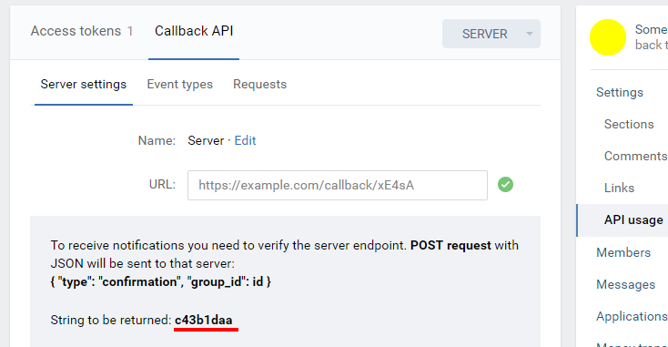

# VK TO TELEGRAM SENDER
Powered by [Telegraf](https://github.com/telegraf/telegraf)  
## What is this?  
This is a utility for express to send fresh posts from VK to Telegram!  
Be careful, it doesn't send **audio and poll's**(maybe fix soon).
## Installation
    npm install git+https://github.com/ejnshtein/vk-to-telegram.git
Soon i'll push it to npm package
### And now a bit example
```js
const app = require('express')(),
    bodyParser = require('body-parser'),
    vkToTelegram = require('vk-to-telegram'),
    vkToTg = new vkToTelegram({
        botToken: token,
        chatName: chatName,
        ownerId: ownerId,
        vkConfirmation: vkConfirmation,
        vkToken: vkToken
    })
app.use(bodyParser.json()) // Must needed
app.post('/', vkToTg.send)

app.listen(80,()=>{
  console.log('listening on port 80')
})  
```
### Variables from example
| Variable | Required | Description |
| - |-| - |
| `token` | **Yes** | Bot token from [Botfather](https://t.me/botfather)    |
| `chatName` | **Yes**  | Telegram channel or group link, like '[@tavernofheroes](https://t.me/tavernofoverwatchnews)' but without @!!!  |
| `ownerId`|**Yes** | Your telegram id for sending error if they are. U can get know it from [@getidsbot](https://t.me/getidsbot) |
| `vkConfirmation` | **Yes** | Confirmation string from ur group callback api server:   |
| `vkToken` | **Yes** | Follow the instructions below:|
|||1. Create Standalone application here: [https://vk.com/apps?act=manage](https://vk.com/apps?act=manage) |
|||2. Open settings in created application and copy application id |
|||3. Open this link with replace your application id: |
|||https://oauth.vk.com/authorize?client_id=YOUR APPLICATION ID&display=page&redirect_uri=http://vk.com/&scope=offline,video,docs&response_type=code&v=5.73|
|||4. Click allow all that need's and it's all! Your token is in query url, do not copy all link, only token without other params!!!  |
|`fromId` | Optional | VK group id with '-'in start or nothing, if you don't need check. |

### Why?

For example, because I had a lot of bot's and when fixing the bug is inconvenient to update the code in all bots.
AND
It's free, yeah ( ͡° ͜ʖ ͡°)
